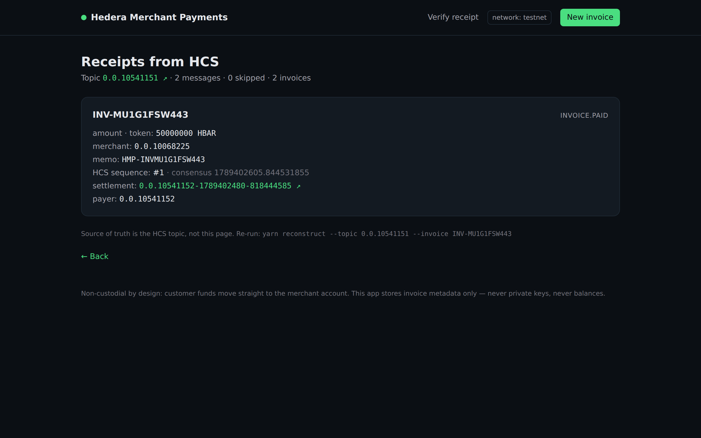

# Hedera Merchant Payments — `scaffold-hbar` template

A **non-custodial merchant payment gateway** for Hedera: your shop issues an invoice,
the customer pays it on-chain, and the gateway verifies, receipts and reports the
payment. No middleman ever holds the money.

```bash
npx create-scaffold-hbar@latest merchant-payments --template adamfreeman2024-eng/hedera-merchant-payments
```

---

## The problem

Accepting crypto payments still means one of three bad options:

1. **Custodial processors** — a third party holds your funds, settles T+1/T+7, and can freeze you.
2. **Raw wallet transfers** — nothing ties a transfer to an order, so reconciliation is a spreadsheet job.
3. **Homegrown scripts** — no audit trail, no webhooks, no refund/expiry rules, no receipts for accounting.

Merchants already accept HBAR and HTS stablecoins on Hedera, but there is no open,
forkable reference gateway that ties **invoice → payment → receipt → webhook** together.
That is what this template ships.

## What it does

| Capability | How |
|---|---|
| Issue an invoice (amount, currency, expiry, memo) | `POST /api/invoices` → row in Postgres **+** `InvoiceRegistry.createInvoice` on-chain |
| Hosted checkout page | `/pay/[invoiceId]` — QR + one-click pay |
| Pay in HBAR | native `CryptoTransfer` with the invoice memo `HMP-<ID>` |
| Pay in an HTS token (e.g. testnet USDC) | **atomic on-chain settlement**: `approve` (HIP-336) then the registry calls `HTS.transferFrom(payer → merchant)` inside the same transaction |
| Pay in **any other HTS token** | **SaucerSwap V1** `swapExactTokensForTokens` in the same transaction (`payInvoiceWithSwap`). Merchant still receives the invoice token. Without the DEX this path does not exist — that is the load-bearing integration. |
| Live any-token **quote** | `GET /api/quote` asks the SaucerSwap V1 factory for a pair (direct, or one hop through WHBAR), then `getAmountsIn`. Checkout **refuses to send** a swap tx until that quote exists. No pool → honest error, not a revert after the user signed. |
| Verify settlement | Mirror Node polling worker matches transfers by memo + amount + merchant account |
| Tamper-evident receipts | every event appended to an **HCS** topic; the sequence number is stored with the invoice |
| **Rebuild the ledger without our database** | `/receipt?topic=0.0.x` and `yarn reconstruct --topic 0.0.x` read the public Mirror Node only |
| Merchant notification | **signed webhooks** (`sha256` HMAC of `timestamp.body`) with retries |
| Expiry / refund handling | `expireInvoice()` on-chain (callable by anyone after the deadline), refunds stay a merchant-signed action |
| Accounting | CSV export + on-chain registry as the source of truth |

## Custody model (the important part)

```
customer wallet ──HBAR transfer (memo HMP-INV…)──────────────▶ merchant account
                 └─HTS same-token: approve ──▶ InvoiceRegistry ──transferFrom──▶ merchant
                 └─HTS any-token:  approve ──▶ InvoiceRegistry ──SaucerSwap V1──▶ merchant
                                                    (atomic hop; leftover tokenIn refunded)
```

- Customer funds move **payer → merchant**. They never touch the gateway, the operator
  account, or the contract.
- `InvoiceRegistry` stores terms and status only — it has no function that can move tokens
  to itself or to the operator.
- The **operator** key (ECDSA) can create invoices and attest an *observed* HBAR settlement
  (recording the transaction id it saw on the Mirror Node). It cannot redirect funds and
  cannot settle a token invoice — that path is atomic and only ever pays the merchant
  encoded in the invoice.
- HBAR `attestHbarSettlement(id, txRef, payer)` records the **real payer** (third argument),
  never `msg.sender`. Token and SaucerSwap paths set `inv.payer = msg.sender` in the same
  transaction.

## Hedera services used

| Service | Usage |
|---|---|
| **Hedera Token Service (HTS)** | token payments via the `0x167` system contract using HIP-336 allowances (`approve` / `allowance` / `transferFrom`) |
| **SaucerSwap V1 (ecosystem)** | load-bearing DEX: `payInvoiceWithSwap` quotes one asset, accepts another. Testnet router `0.0.19264`, mainnet `0.0.3045981`. If a pair has no testnet pool, document a forked-mainnet / read-only quote as the brief allows. |
| **Consensus Service (HCS)** | settlement/expiry/cancel receipts (`TopicMessageSubmitTransaction`) |
| **Smart Contracts** | `InvoiceRegistry` invoice ledger (OpenZeppelin `Ownable` for key rotation) |
| **Mirror Node REST** | reconciliation of native HBAR transfers by memo, amount and destination |
| **Scheduled Transactions (HSS, `0x16b`)** | HIP-1215 `scheduleCall`: `scheduleExpire(id)` queues `expireInvoice` at the deadline so expiry needs no worker. HSS does not revert — we check response code 22. |

## Architecture

```
packages/hardhat     InvoiceRegistry.sol + hardhat-deploy + typechain (contracts, tests)
packages/ledger      Prisma schema + domain rules (money units, invoice state machine,
                     HCS receipts, signed webhooks) — unit-tested, shared by app & worker
packages/nextjs      merchant dashboard, hosted checkout, public API (App Router)
services/reconciler  long-running worker: Mirror Node → ledger → HCS → webhooks
```

Everything money-related lives in `packages/ledger` as pure, unit-tested functions
(`bigint` end-to-end — floats never touch settlement math).

## Quickstart

```bash
# 1. scaffold
npx create-scaffold-hbar@latest merchant-payments --template adamfreeman2024-eng/hedera-merchant-payments
cd merchant-payments

# 2. env + ledger
cp .env.example .env
cp packages/nextjs/.env.example packages/nextjs/.env
yarn ledger:up          # Postgres via docker compose
yarn db:migrate

# 3. accounts (operator = gateway signer, merchant = settlement account)
yarn hardhat:account:generate     # prints an ECDSA account + private key
#   fund it: https://portal.hedera.com/faucet

# 4. contracts
yarn hardhat:compile
yarn hardhat:test
yarn hardhat:deploy --network hederaTestnet     # prints INVOICE_REGISTRY_ADDRESS

# 5. HCS receipt topic
yarn reconciler:once --init-topic               # prints HCS_RECEIPT_TOPIC_ID

# 6. run
yarn next:dev                                   # dashboard + checkout on :3000
yarn reconciler:dev                             # reconciliation worker (2nd terminal)
```

Full click-by-click instructions, including a testnet end-to-end walkthrough and
troubleshooting: **[RUNBOOK.md](./RUNBOOK.md)**.

## Verify a receipt with no credentials

The HCS topic is the source of truth. This rebuilds invoice `INV-MU1G1FSW443` from the
public Mirror Node — no `.env`, no database, no operator key:

```bash
yarn reconstruct --topic 0.0.10541151 --invoice INV-MU1G1FSW443
# → kind: invoice.paid, paymentTxId: 0.0.10541152-1789402480-818444585
```

Same data in the browser: [`/receipt?topic=0.0.10541151&id=INV-MU1G1FSW443`](https://hashscan.io/testnet/topic/0.0.10541151)



Live quote (SaucerSwap V1 factory `0.0.9959`, 1 SAUCE out, WHBAR in):

```bash
curl "http://localhost:3000/api/quote?tokenIn=0.0.15058&tokenOut=0.0.1183558&amountOut=1000000"
# → hop: direct, amountIn: 1819520, amountInMax: 1837715 (100 bps slippage)
```

## What this template is not

It does **not** clone the eight official `scaffold-hbar` templates (`blank`, `hedera-demo`,
`oracles`, `payments-scheduler`, `bridge`, `cross-chain-dca`, `tokenize-subscriptions`,
`x402-pay-per-use`). A checkout that only settles the invoice token, or stamps HCS
*after* the fact as an optional API, is a different (weaker) pattern: here the DEX
quote is load-bearing, the swap is the settlement, and HCS is readable without us.

## Tests

```bash
yarn test              # contract tests (invoice lifecycle, access control, expiry, SaucerSwap, HIP-1215)
yarn workspace @hmp/ledger test    # money/units, state machine, webhooks, quote path, HCS reconstruct
yarn reconstruct --topic 0.0.10541151   # live Mirror rebuild (needs network, no keys)
yarn typecheck         # all workspaces
```

## Security notes

- Private keys are read from env only; nothing is written to disk except the generated
  `.account` file used by `hardhat:account:*` (gitignored).
- The operator/treasury account pays HCS fees and gas. It is **not** a funds sink.
- Webhooks are signed and replay-window protected (`verifySignature` is exported so
  merchants can copy it).
- The registry is `Ownable` so the merchant can rotate the gateway operator key.

## Status & roadmap

Verified locally (commands and results, not claims):

| Milestone | Command | Result |
|---|---|---|
| Contract compiles | `yarn hardhat:compile` | ✅ 3 files, solc 0.8.28, evm target `paris` |
| Contract behaviour | `yarn hardhat:test` | ✅ **16 passing** (lifecycle, HTS/SaucerSwap, HIP-1215 scheduleExpire, attest records the real payer) |
| Ledger domain rules | `yarn workspace @hmp/ledger test` | ✅ **23 passing** (units, memo, state machine, webhook signatures, entity→EVM, SaucerSwap path/quote, HCS reconstruct) |
| Template contract | `create-scaffold-hbar` with `CREATE_SCAFFOLD_HBAR_TEMPLATE_DIR` | ✅ 18.09.2026: scaffolds, outro renders, `.env.example` includes `SAUCERSWAP_ROUTER` |
| Fresh clone `yarn verify` | `git clone . /tmp/fresh && node .yarn/releases/yarn-3.2.3.cjs install && yarn verify` | ✅ 18.09.2026: install 1m43s, **exit 0** — tsc + **16** hardhat + **11** ledger (no `.env`) |
| Harness artifacts | `harness/` (spec, static + yarn validators, Playwright smoke, 8-assertion acceptance contract) | ✅ all valid JSON/YAML; contract: 2 critical / 5 major / 1 minor |
| App build | `yarn next:build` | ✅ Next.js 15, 10 routes compiled (`/api/quote`, `/api/receipts`, `/receipt` added 23.09.2026) |
| App read path with **no configuration at all** | `next start` with every env var unset | ✅ dashboard renders with setup guidance, `/new` 200, `/api/health` lists what is missing, `POST /api/invoices` → clean 503 (no crash) |
| Local end-to-end | docker Postgres + `prisma migrate dev` + app | ✅ create → list → checkout page → invalid amount 400 → cancel |
| **Testnet end-to-end (chain 296)** | app + worker, real HBAR | ✅ see below |

### Testnet evidence (publicly verifiable, no keys needed)

Current ABI (18.09.2026) — operator `0.0.9586920` / `0xE1B590d179a8dA38eAE3219aEd8b05fFa33741a1`:

| Artifact | Value |
|---|---|
| InvoiceRegistry | `0x7385E85823393A6e498e9cdb158C8300F9018F4b` · Hedera `0.0.10600857` |
| Deploy tx | `0.0.7314364-1789727595-506480301` (`0x3adc2d0a…`) |
| SaucerSwap V1 router | `0.0.19264` (`0x…4b40`) set on the registry in the same session |
| HIP-1215 `scheduleExpire` | create `0.0.7314364-1789727663-791961116` · schedule `0.0.7314364-1789727671-967513663` · schedule entity `0x…A1c1a6` |
| SaucerSwap V1 live quote | factory `0.0.9959` (592 pairs) · SAUCE/WHBAR pair `0xfE7CC3cEb7b1128bfC3889184E2d5561BF74bfb3` · `getAmountsOut(1 WHBAR)` → `55098698` SAUCE base units |
| Live `payInvoiceWithSwap` | associate `0.0.9586920-1789748210-854425227` · HBAR→SAUCE via router `0.0.7314364-1789748218-167895791` (demo acquired SAUCE with `swapExactETHForTokens`, never approved WHBAR) · pay `0.0.7314364-1789748240-167185116` · invoice **SETTLED**, payer `0xE1B590…` |
| HashScan contract | https://hashscan.io/testnet/contract/0.0.10600857 |
| HashScan live swap (SETTLED) | https://hashscan.io/testnet/transaction/0.0.7314364-1789748240-167185116 |
| Mirror Node (JSON, curl-friendly) | https://testnet.mirrornode.hedera.com/api/v1/transactions/0.0.7314364-1789748240-167185116 |

Earlier HBAR checkout evidence (14.09.2026, previous registry `0xc978548F1c4606CE7A2d15D8ED31Fe88820Df670`):

| Artifact | Value |
|---|---|
| HCS receipt topic | `0.0.10541151` (seq 1, seq 2) |
| Invoice 1 | `INV-MU1G1FSW443` — 0.5 HBAR, paid by `0.0.10541152`, tx `0.0.10541152-1789402480-818444585` |
| Invoice 2 | `INV-MU1GDH4M599` — 0.25 HBAR, paid by `0.0.10541152`, tx `0.0.10541152-1789403045-808216195` |

### Known limitations (honest list)

- **EVM wallets cannot attach a Hedera memo**, so a MetaMask-style HBAR transfer will never reconcile — that is why the HTS path exists. The checkout page states this.
- **Multiple merchants per deployment** is not in this template.

- [x] `InvoiceRegistry` with atomic HTS settlement + attested HBAR settlement (payer recorded, not the operator)
- [x] SaucerSwap V1 any-token settlement (`payInvoiceWithSwap`) — unit tests **and** live testnet SETTLED `0.0.7314364-1789748240-167185116`
- [x] Ledger domain rules (units, memo, state machine, webhook signing) with unit tests
- [x] HCS receipt writer (submit + sequence capture) — exercised on testnet topic `0.0.10541151`
- [x] Next.js dashboard + hosted checkout (one-click HTS + SaucerSwap paths)
- [x] Mirror Node reconciler worker + webhook delivery queue (`links.next` pagination)
- [x] Testnet end-to-end walkthrough with recorded transaction ids (HBAR path)
- [x] HIP-1215 `scheduleExpire` via HSS `0x16b` — mock unit tests **and** live testnet tx `0.0.7314364-1789727671-967513663`
- [x] Live SaucerSwap V1 quote (`GET /api/quote`) — factory `getPair` + `getAmountsIn`, 1% slippage, fail-closed if no pool. Verified 23.09.2026: 1 SAUCE out ← 1 819 520 WHBAR tinybar in (`amountInMax` 1 837 715)
- [x] HCS reconstruct without the database (`yarn reconstruct` + `/receipt?topic=`) — live topic `0.0.10541151` rebuilds `INV-MU1G1FSW443` as `invoice.paid`
- [ ] Merchant onboarding (multiple merchants per deployment)

Licence: MIT.

## Submission checklist

- [x] Repo is public (21.09.2026): https://github.com/adamfreeman2024-eng/hedera-merchant-payments
- [ ] `.github/workflows/ci.yaml` is committed. It is ignored right now because the
      GitHub token in use has no `workflow` scope; run `gh auth refresh -s workflow`
      and then `git add -f .github/workflows/ci.yaml && git commit -m "ci: add workflow"`.
- [x] README status table matches the latest local runs (21.09.2026).
- [x] No secrets in the tree besides Hardhat account #0 (named `HARDHAT_DEV_KEY`).
